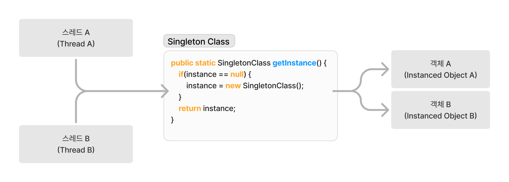
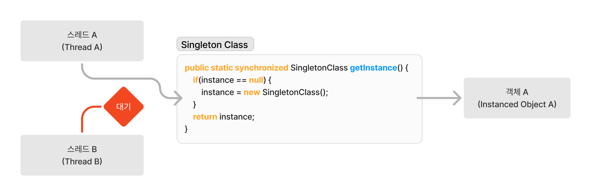

# 싱글톤 패턴(Singleton)


---
## 요약
인스턴스화 된 객체가 단 하나만 있다는 것을 보장해 전체 애플리케이션 내에서 동일한 객체 인스턴스에 접근을 보장하고, 생성된 인스턴스를 재활용해 생성에 필요한 리소스를 절약할 수 있다.  

---
## 싱글톤은 왜 사용할까?
**싱글톤 패턴은 클래스에 대해서 최초로 생성되는 객체에 대해서만 메모리를 할당해 전체 애플리케이션에서 단 하나의 인스턴스 사용을 보장**한다. 이 패턴은 사용이 고안 되었을까? 
가장 큰 이유는 **단일 인스턴스를 사용하게 될 경우 전체 애플리케이션에서 메모리에 대한 효율성을 증대시킬 수 있으며, 부가적으로 단일 인스턴스를 사용하기에 전역적으로 관리해야할 상태 또는 값에 대해서 손쉽게 관리가 가능**한 이점이 있다.

초기화 과정에 대해서 비용이 많이 소모되거나 전역적으로 관리가 필요한 사용처에서 많이 이용되는데 대표적으로 `Database Connection Pool` 과 `logging`에 많이 사용된다.
두 사용처 모두 공통적으로 **전역적으로 사용되다보니 무분별한 사용으로 리소스가 낭비될 위험이 크고, 연결 정보나 로거에 대한 설정이 관리되어야 하기 때문에 싱글톤 패턴을 사용한다.** 

## 어떻게 보장하는 걸까
`Spring Bean`이 등장하기 이전 `Java`에서는 어떻게 구현해 단일 인스턴스 객체를 보장하고 전역적으로 사용할 수 있었을까?
싱글톤 패턴 자체를 구현하는 것 그리 어렵지 않는데 사용하고자 하는 **클래스에 대해서 무분별한 생성으로 발생되는 인스턴스화를 막고, 의도적으로 이미 생성된 객체를 재사용할 수 있도록 반환**해주는 것이 주요 포인트 이다.

```java
public class SingletonClass {
    // 클래스가 로딩 될 때 객체 인스턴스화를 통해서 초기화
    private static final SingletonClass instance = new SingletonClass();
    // 프로그램 내에서 무분별한 인스턴스화를 막기위해서 생성자 private 화
    private SingletonClass() { }
    // 생성된 객체를 재사용하기 위해서 의도적으로 이미 생성된 인스턴스를 반환해서 사용하도록 함
    public static SingletonClass getInstance() {
        return instance;
    }
}
```
본 클래스는 `static final`을 이용해서 전역적으로 사용할 수 있도록 인스턴스를 `JVM`에 클래스를 로드할 때 자동적으로 초기화할 수 있도록 구성하고, 생성자를 `private`로 만들어 애플리케이션 내부에서 의도치 않은 인스턴스화를 막을 수 있도록 구현한다.
이렇게 구성될 경우엔 해당 클래스를 생성자로 신규 인스턴스를 만들 수 없어 `JVM`에 클래스가 로드될 때 생성되는 인스턴스가 애플리케이션내에서 유일한 인스턴스를 보장할 수 있게 된다.
그리고, `getInstance()`메소드를 구현하여 애플리케이션내에서 필요할 경우 미리 생성된 인스턴스를 반환해 간단하게 싱글톤 패턴의 의도를 고려해 구현할 수 있다. 
```java
import org.junit.jupiter.api.Test;

import static org.junit.jupiter.api.Assertions.assertSame;
import static org.junit.jupiter.api.Assertions.assertNotNull;

class SingletonClassTest {
    @Test
    void 단일_인스턴스_테스트() {
        SingletonClass singleton1 = SingletonClass.getInstance();
        SingletonClass singleton2 = SingletonClass.getInstance();
        
        assertSame(singleton1, singleton2, "단일 인스턴스가 아닙니다.");
    }
    
    @Test  
    void 인스턴스_Not_null() {
        SingletonClass singleton = SingletonClass.getInstance();
        
        assertNotNull(singleton, "인스턴스는 null이 아니어야 합니다.");
    }
}
```

>`Spring Bean` 과 `Java Singleton`의 차이
>

## 구현
하지만 위에서 예시로 구현한 싱글톤 방식에는 **해당 클래스가 사용되지 않더라도 애플리케이션에서는 메모리를 할당하게 되어 불필요한 리소스가 소모되는 문제점이 존재**한다.
리소스가 작고 애플리케이션이 가지고있는 메모리가 넉넉하다면 크게 문제는 없겠지만, 클래스 자체가 초기 생성에 큰 비용이 동반될 경우 이 방식은 불필요한 메모리 소모가 발생한다.
그렇다면 해당 클래스 코드에서 `JVM`로드에 초기화되는 부분인 `private static final SingletonClass instance = new SingletonClass();` 제거하면 모든게 해결되어 좋은 싱글톤 패턴 구현코드가 될 수 있을까? 

```java
public class SingletonClass {
    private static SingletonClass instance;
    // 프로그램 내에서 무분별한 인스턴스화를 막기위해서 생성자 private 화
    private SingletonClass() { }
    // 객체가 없는데 사용할 경우 그 때 초기화 하여 인스턴스화, 그 후 호출 시 생성된 인스턴스를 재활용 하도록 반환
    public static SingletonClass getInstance() {
        if(instance == null) {
            instance = new SingletonClass();
        }
        return instance;
    }
}
```
이렇게 `JVM`에 의해서 자동으로 클래스를 인스턴스화 하지 않고 실제로 사용될 때 없다면 인스턴스화 시킨 후 반환하면 의도한대로 불필요한 메모리 낭비를 줄일 수 있게된다.
실제로 이렇게 구현해서 사용될 경우 **단 하나의 스레드만 사용하는 `Single-thread` 환경에서는 큰 문제가 발생하지 않는다, 하지만 한 번에 많은 요청을 처리하기 위해 여러 스레드를 사용하는 `Multi-thread`환경에서는 안전하지 못하다.** 
그 이유는 아래 테스트를 동작해보면서 알아보자

```java
import org.junit.jupiter.api.Test;

import java.util.ArrayList;
import java.util.HashSet;
import java.util.List;
import java.util.Set;
import java.util.concurrent.Callable;
import java.util.concurrent.ExecutionException;
import java.util.concurrent.ExecutorService;
import java.util.concurrent.Executors;
import java.util.concurrent.Future;

import static org.junit.jupiter.api.Assertions.*;

class LazySingletonTest {
    @Test
    void 멀티_스레드_환경_인스턴스_테스트() throws ExecutionException, InterruptedException {
        // 스레드 수 설정
        int threadCount = 100;
        ExecutorService executor = Executors.newFixedThreadPool(threadCount);

        // Callable을 사용하여 getInstance()를 호출
        Callable<LazySingleton> task = LazySingleton::getInstance;

        // Future 리스트에 모든 태스크 제출
        List<Future<LazySingleton>> futures = new ArrayList<>();
        for (int i = 0; i < threadCount; i++) {
            futures.add(executor.submit(task));
        }

        // 모든 인스턴스를 수집
        Set<LazySingleton> instances = new HashSet<>();
        for (Future<LazySingleton> future : futures) {
            LazySingleton instance = future.get();
            instances.add(instance);
        }

        // 스레드 종료
        executor.shutdown();

        // 인스턴스의 크기를 검증
        if (instances.size() != 1) {
            System.out.println("생성된 인스턴스 갯수: " + instances.size());
            System.out.println("인스턴트들의 HashCodes:");
            for (LazySingleton instance : instances) {
                System.out.println(System.identityHashCode(instance));
            }
        }

        // 단일 인스턴스가 아니면 테스트 실패
        assertEquals(1, instances.size(), "Multiple instances were created, singleton is not enforced.");
    }
}
```
본 테스트 케이스를 실행한 당신은 성공되는 경우도 있고 실패도 간혈적으로 발생하는 것을 볼 수 있다. **결과적으로 해당 클래스는 `Multi-thread` 환경에서 안전하지 못해 `Thread-safety`하지 않다.** 
코드를 보면 `null`체크도 하고 없을 때 생성도 하고 반환도 제대로 되는데 코드상 이게 왜? 안전하지 못하지라고 생각할 수 있다.  
당연히 필자도 처음 해당 코드를 보고 왜 안전하지 못한지 바로 파악할 수 없었으니 같이 코드를 보면서 어떤 부분이 `Thread-safety`한지 알아보자, 가장 문제를 발생시키는 부분은 바로 `null`체크하고 인스턴스를 반환하는 부분이다.
```java
public static SingletonClass getInstance() {
    if(instance == null) {
        // 만약 이 해당 조건 분기에서 동시에 스레드가 들어온다면 어떨까 한 번 생각해보도록 하자
        instance = new SingletonClass();
    }
    return instance;
}
```
**만약 여러개의 `Thread`가 동시에 `if` 조건 분기에 도달하여 실행되었다고 가정해보자, 그럼 해당 클래스에는 생성된 인스턴스가 존재하지 않기 때문에 스레드는 `null`로 판단한여 새로운 인스턴스를 생성**하게 될 것이다.
결국 아래 그림 처럼 접근한 `Thread`는 각자가 생성한 인스턴스를 반환하게 되는 경우가 발생하게 된다.



물론 단순히 생각해보면 저기에 `Thread`가 동시에 들어올 확률이 얼마나 된다고 큰 문제가 발생하냐고 생각할 수 있지만, 컴퓨터의 연산속도와 `CPU`의 스케쥴링 속도는 엄청난 속도로 반복되므로 그 확률은 무시할 수 없다. 
실제로도 위의 테스트 케이스를 돌려보면 `Thread`가 100개인 상황에서도 간혈적으로 발생하는데, 실제로 많은 사용자가 이용하는 서비스의 경우에는 발생 확률이 늘어서 해결해야할 문제가 될 것이다.

### 구현 모델
이 처럼 `Multi-thread` 환경에서 발생하는 동시성 문제를 해결하고자 수 많은 개발자는 싱글톤 패턴의 이점을 살리고자 많은 방식을 제시하고 구현하는 등 노력을 기울였다.
그렇다면 현재 제시되어온 구현 모델을 하나씩 살펴보고 해결 했던 방식과 발생했던 문제를 살펴보자

#### 모델 1. Eager Initialization 이른 초기화 모델
```java
public class EagerSingleton {
    private static final EagerSingleton instance = new EagerSingleton();
    
    private EagerSingleton() { }
    
    public static EagerSingleton getInstance() {
        return instance;
    }
}
```
이 코드는 처음 싱글톤 패턴을 설명하기 위해서 사용 되었던 구현 모델로 **클래스의 인스턴스가 `JVM`의 `ClassLoader`가 `Loading`하는 과정에서 생성되어 메모리에 올라가기 때문에 `Multi-thread` 환경에서도 안전하게 사용**이 가능하다.
하지만, 생성된 인스턴스가 실제로 사용되지 않을 경우에는 해당 인스턴스는 결국 불필요한 메모리를 차지하는 문제가 발생한다.
##### 해결한 문제
- `Thread-safety`한 싱글톤 패턴을 보장

##### 고려해야할 문제
- 실제로 사용되지 않는 클래스일 경우, 불 필요한 메모리 자원이 사용됨
- 본 클래스의 인스턴스가 비용이 클 수록 더 큰 자원의 낭비가 야기됨

#### 모델 2. Lazy Initialization 늦은 초기화 모델
```Java
public class LazySingleton {
    private static LazySingleton instance;
    
    private LazySingleton() { }
    
    public static LazySingleton getInstance() {
        if(instance == null) {
            instance = new LazySingleton();
        }
        return instance;
    }
}
```
본 모델은 **`JVM`에 초기 인스턴스 생성을 위임한 `Eager Initialization`의 자원 낭비 문제점을 해결하고자 인스턴스 생성을 첫 요청으로 변경**시킨 코드이다.
앞서 설명했듯이 해당 구현 모델은 대표적으로 `Multi-thread` 환경에서의 동시성 문제를 발생시킨다.
##### 해결한 문제
- 실제로 사용되지 않는 클래스에 대해서 인스턴스를 생성하지 않기 때문에 자원 낭비를 방지
##### 고려해야할 문제
- `Thread-safety`하지 않음 여러 스레드가 동시에 인스턴스 생성에 진입할 경우, 고유하지 않은 인스턴스가 생성될 문제가 있음

#### 모델 3. Synchronized Lazy Initialization 늦은 동기화 모델
```Java
public class SynchronizedLazySingleton {
    private static SynchronizedLazySingleton instance;

    private SynchronizedLazySingleton() { }

    public static synchronized SynchronizedLazySingleton getInstance() {
        if(instance == null) {
            instance = new SynchronizedLazySingleton();
        }
        return instance;
    }
}
```
이 모델은 `Lazy Initialization`의 스레드간 경쟁(`Race Condition`)으로 발생하는 `Thread-safety`하지 않는 문제를 해결하고자 한 모델로, 여러 스레드 중 먼저 `getInstance()`에 진입될 경우 다른 스레드는 먼저 진입한 스레드가 종료될 때 까지 대기하는 상태가 된다.
이 결과로 애플리케이션 전체에 대해서 고유한 객체를 보장할 수  있게 되어 **`Thread-seafety`성질을 보장할 수 있게 된다. 하지만, 동기화(`Synchronized`)에서 대기하는 과정이 추가되면서 생성이 되었음에도 한 번에 하나의 스레드만 `getInstance()` 진행할 수 있기 떄문에 전체적인 성능 저하를 발생**시키게 된다.

##### 해결한 문제
- `Thread-safety`보장해 `Multi-thread`환경에서도 안정적인 싱글톤 패턴 구현 가능
##### 고려해야할 문제
- `Synchronizaed`과정으로 발생하는 성능 저하

#### 모델 4. Double-Checked Locking 더블 체크 락킹 모델
```java
public class DoubleCheckedLockingSingleton {
    private static volatile DoubleCheckedLockingSingleton instance;

    private DoubleCheckedLockingSingleton() { }

    public static DoubleCheckedLockingSingleton getInstance() {
        if(instance == null) {
            synchronized (DoubleCheckedLockingSingleton.class) {
                if(instance == null) {
                    instance = new DoubleCheckedLockingSingleton();
                }
            }
        }
        return instance;
    }
}
```
`Synchronized Lazy Initialization` 와 달리 `Synchronized` 블록을 메소드에 선언하지 않고 메소드 내부에 두 번째 체크에 선언하여, **첫 번째 `if` 조건문은 동기화 없이 진행되고 두 번째 `if`조건문 부터 동기화된 블록에서 수행되도록 수정한 모델**이다.
해당 모델은 메소드 전체에 동기화 블록을 제거해 성능적인 영향을 최소화 시킨 방식이다. 특이점이 있다면 `volatile` 키워드가 추가해 스레드간 `I/O` 불일치 문제를 해결할 수 있도록 했다.
> `volatile` 키워드
> `Java`에서 성능을 위해서 각각의 스레드들은 변수를 메인 메모리(`RAM`)으로 부터 데이터를 가져오는 것이 아니라 캐시 메모리(`CPU Cache`) 가져온다. 
> 하지만 이 구조는 스레드별 다른 캐시 메모리에 접근해서 변수 값을 가져올 경우에 일치하지 않는 문제를 야기 시키는 문제가 발생해, `volatile` 키워드로 변수를 선언해 값을 캐시가 아닌 메인 메모리에 직접적으로 `I/O` 할 수 있도록 지정한다.
> 
##### 해결한 문제
- 동기화 블록을 통해서 `Thread-safety`를 보장해 `Multi-thread`환경에서도 안정적인 싱글톤 패턴 구현 가능
- 이미 인스턴스화가 진행된 후 동기화 블록에 진입되지 않기 떄문에 `Synchronized Lazy Initialization` 보다 높은 성능을 보여줌 
##### 고려해야할 문제
- `volatile`키워드로 인한 복잡성과 세밀한 구현 방식이 요구됨
- `Synchronized` 블록이 메소드에 선언되어있지 않아 동기화 블록을 줄일 수 있지만, 초기에 발생되는 동기화 과정으로 발생되는 성능 문제는 고려 

#### 모델 5. Enum 모델
```java
public enum EnumSingleton {
    INSTANCE
}
```
`Java`에서의 `Enum`형식을 이용해서 싱글톤 패턴을 간단하게 구현할 수 있는 모델이다. 해당 방식을 사용할 경우 `Thread-safety`성질을 `Compiler`와 `JVM`에 의해서 보장할 수 있다.
##### 해결한 문제
- `Compiler`와 `JVM`에 인스턴스 생성을 위임했기에 `Thread-safety`함 
- 매우 간단한 구현으로 싱글톤이 구현이 가능
##### 고려해야할 문제
- `Enum` 타입의 제약으로 상속을 지원하지 않고, 실제 사용에 대해서는 유연하지 못함

#### 모델 6. Lazy Holder 모델
```java
public class HolderSingleton {
    private HolderSingleton() { }

    private static class Holder {
        private static final HolderSingleton instance = new HolderSingleton();
    }

    public static HolderSingleton getInstance() {
        return Holder.instance;
    }
}
```
