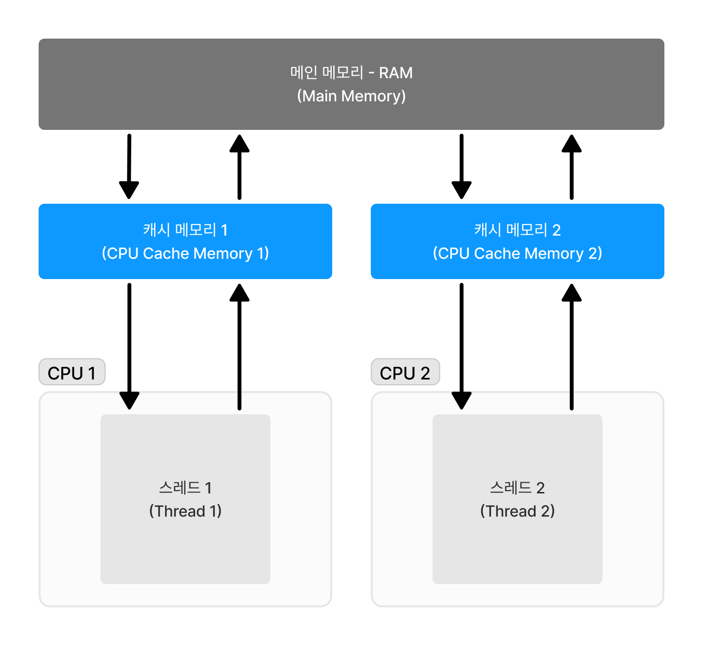
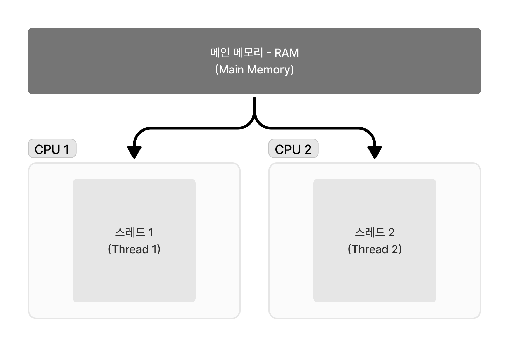

# Volatile 키워드


---
## Multi-thread 환경에서의 변수 읽기/쓰기
`volatile`키워드를 설명하기 앞서 제대로 이해하고 사용하기 위해서는 `Multi-thread`환경에서 스레드가 어떤 과정으로 읽기/쓰기 작업이 수행되는지 이해할 필요가 있다.
현대 컴퓨터의 `CPU`들은 연산에서 `Main Memory` 접근하지 않고 개별적으로 배치된 `Cache Memory`를 이용해 데이터를 저장한다. 
본 구조로 구현될 경우 연산에 필요한 데이터를 각 `CPU` 별 `Cache Memory` 공간에 저장히기 때문에 상대적으로 빠르게 접근할 수 있어 성능의 효율성을 확보했다.
이로 인해서 `Thread`들도 성능 향상을 위해서 컴퓨터의 `Main Memory`가 아닌 `CPU Cache Memory`에 접근하여 성능을 향상 시킬 수 있었다.


- `Thread`에서 변수를 사용할 경우, `CPU`는 `Cache Memory`를 확인
- `Cache Memory`에 존재 한다면, 그대로 읽어들여 사용할 수 있도록 함(=`Cache hit`)
- 없다면, `Main Memory`로 부터 변수를 로드하여 `Cache Memory`에 복사하여 사용(=`Cache miss`)
- 읽어온 후 변수에 대해서 지정된 연산(증가, 감소) 후 `Cache Memory`의 데이터를 업데이트
- `Main Memory`에 동기화

과정을 통해서 각 스레드에서 연산된 데이터들이 메인 메모리에 저장되게 됩니다.

## Volatile 키워드 란?
```java
public class VolatileSample {
    private static volatile int value;
}
```
위의 코드 처럼 `volatile`키워드가 붙은 변수는 `Cache Memory`가 아닌 `Main Memory`로 읽기/쓰기 할 수 있도록 명시함과 동시에, `JVM Compiler`의 최적화에 해당되지 않게 됩니다.
- `value` 값은 `JVM Compiler`에 의해서 발생되는 최적화의 대상이 되지 않음
- `value` 값은 `Cache Memory`가 아닌 `Main Memory`에 저장됨
- `value` 값은 `Cache Memory`에 저장된 값이 아닌 `Main Memory`에서 읽어 오도록 함


## 왜 사용하지?


## Reference
- 
- https://jenkov.com/tutorials/java-concurrency/volatile.html
- https://wlgns2305.tistory.com/239